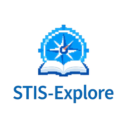

# 🎮 STISMAP — Interactive Virtual Campus

<div align="center">



**Peta & panduan kampus Politeknik Statistika STIS dalam bentuk game RPG pixel 2D**

[](https://vuejs.org/)
[](https://www.typescriptlang.org/)
[](https://phaser.io/)
[](https://vitejs.dev/)
[](https://www.mapeditor.org/)

</div>

---

## 📖 Deskripsi

STISMAP adalah **virtual campus explorer** untuk Politeknik Statistika STIS (Kampus Otista,
Jl. Otto Iskandardinata No.64C, Jakarta Timur). Pengunjung berjalan dengan karakter pixel di
peta kampus, mendekati gedung, berbicara dengan NPC, lalu **masuk ke gedung → memilih lantai →
melihat denah interaktif → membuka detail ruangan**.

> Tata letak peta mengikuti footprint **OpenStreetMap**; informasi gedung dari **sumber publik**;
> denah ruangan saat ini masih **data demo** (ditandai jelas di UI) sampai denah resmi tersedia.

## ✨ Fitur

| Fitur | Keterangan |
| --- | --- |
| 🚪 Layar pembuka | Logo, "EXPLORE OUR CAMPUS", pilih karakter, tombol ENTER CAMPUS |
| 🗺️ Peta kampus RPG | Phaser + Tiled, collision, kamera halus (lerp), zoom responsif, batas map |
| 🧍 Karakter | WASD / panah, lari (SHIFT), animasi idle & jalan 4 arah |
| 🏫 Interaksi gedung | Prompt `[E]` saat mendekat → info gedung → **Explore Building** |
| 🏢 Lantai & denah | Pemilih lantai + denah **SVG** interaktif (klik/keyboard), legenda jenis ruangan |
| 🚪 Detail ruangan | Kode, kapasitas, fasilitas ✓, deskripsi, foto, BACK TO FLOOR |
| 🧑‍🤝‍🧑 NPC kampus | Pemandu, satpam, mahasiswa, staf — dialog bercabang dengan pilihan & aksi |
| 🔍 Pencarian & direktori | Cari gedung/ruangan/lab/fasilitas → fast travel atau sorot ruangan di denah |
| 🧭 Mini-map | Dibuat otomatis dari tilemap, posisi pemain real-time, klik gedung untuk pergi |
| 📍 Marker | 🏫 🕌 🍴 🅿️ 🏧 🚻 👮 🚌 … dapat di-toggle per kategori |
| 📱 Mobile | Joystick virtual + tombol INTERACT, layout responsif |
| 🔗 Deep link | `/campus`, `/building/gedung-2`, `/building/gedung-2/floor/4`, `.../room/g2-4-01` |
| ⚠️ Error handling | Layar error + RETRY bila peta/sprite/data gagal dimuat |
| ♿ Aksesibilitas | Navigasi keyboard, focus trap modal, aria-label, kontras tinggi |

## 🛠️ Teknologi

Vue 3 · TypeScript · Vite · Phaser 3 (Arcade Physics) · Pinia · Tiled Map Editor.
Tidak ada dependency tambahan — deep link memakai History API, tileset dibuat dengan script Node tanpa library.

## 🚀 Menjalankan

```bash
npm install
npm run dev        # http://localhost:5173
npm run build      # type-check + build ke dist/
npm run preview    # menjalankan hasil build
```

Script tambahan:

```bash
npm run typecheck                # cek TypeScript saja
npm run assets:tileset           # buat ulang tileset pixel art
npm run assets:map -- --force    # buat ulang map awal (MENIMPA kampus.json)
```

> **Deploy:** karena memakai deep link berbasis path, server hosting perlu *SPA fallback*
> (semua path diarahkan ke `index.html`). Contoh: Netlify `_redirects` → `/* /index.html 200`,
> Vercel `rewrites`, Nginx `try_files $uri /index.html`.

## 🎮 Cara Bermain

| Aksi | Keyboard | Layar sentuh |
| --- | --- | --- |
| Berjalan | `W A S D` / tombol panah | Joystick kiri bawah |
| Lari | tahan `SHIFT` | Dorong joystick penuh |
| Interaksi / lanjut dialog | `E` / `SPACE` | Tombol **INTERACT** |
| Tutup panel / buka menu | `ESC` | Tombol ✕ / ☰ |
| Pencarian | `/` atau `F` | Tombol 🔍 |
| Mini-map | `M` | Tombol 🗺️ |
| Zoom | `+` / `-` / scroll | Menu → Zoom |

Alur: **Opening → Enter Campus → Peta → NPC / Gedung → Info Gedung → Pilih Lantai → Denah → Ruangan → Back to Campus**.

## 📁 Struktur Proyek

```
stismap/
├── public/images/            # logo & favicon teroptimasi
├── tools/                    # generator tileset & map awal (Node, tanpa dependency)
├── src/
│   ├── assets/
│   │   ├── maps/kampus.json          # map Tiled (layer + object layer)
│   │   ├── maps/tileset_kampus.tsj   # tileset Tiled (eksternal, opsional)
│   │   ├── player/chibi-layered.png  # spritesheet karakter (3 karakter × 9 frame)
│   │   └── tilesets/tileset_kampus.png
│   ├── components/           # UI Vue (dialog, modal gedung, denah, direktori, HUD, mini-map, ...)
│   ├── composables/          # deep link & navigasi kampus
│   ├── game/
│   │   ├── Game.ts / main.ts # konfigurasi & pembuatan game Phaser
│   │   ├── EventBus.ts       # perintah Vue -> Phaser (travel, interact, zoom)
│   │   ├── shared.ts         # state per-frame non-reaktif (posisi pemain, joystick)
│   │   ├── scenes/           # BootScene, PreloadScene, CampusScene
│   │   ├── objects/          # Player, NPC, Building, InteractiveObject
│   │   ├── systems/          # Interaction, Collision, Camera, Marker, Minimap
│   │   └── data/             # buildings, floors, rooms, facilities, npcs, campus (lookup/search/validasi)
│   ├── stores/               # Pinia: uiStore, campusStore, dialogStore, inputLock
│   ├── views/                # IntroScreen, GameView
│   ├── App.vue · main.ts · style.css
├── CARA_MEMBUAT_MAP.md       # 📘 cara mengubah map & menambah gedung/lantai/ruangan/NPC
└── ...
```

### Arsitektur Vue ↔ Phaser

- **Phaser**: map, pemain, collision, gerak, NPC, deteksi interaksi.
- **Vue**: semua panel/modal, denah, pencarian, direktori, HUD.
- **Pinia** adalah jembatan untuk *event penting saja* (mis. `campusStore.setNearby()` hanya saat target berubah,
  `campusStore.openBuilding()` saat menekan E). Posisi pemain per-frame **tidak** disimpan di Pinia.
- Saat overlay terbuka, Phaser mengunci gerak dan melepas tangkapan keyboard agar input teks berfungsi.

## 🧩 Menambah Gedung / Lantai / Ruangan

Lihat **[CARA_MEMBUAT_MAP.md](CARA_MEMBUAT_MAP.md)**. Ringkasnya: gambar & beri objek `type=building`
(`buildingId`) di Tiled → tambah data di `buildings.ts` → `floors.ts` → `rooms.ts` → `npm run dev`.
Data divalidasi otomatis saat start.

## 📊 Status Data

| Lencana | Arti |
| --- | --- |
| ⓘ **Info Publik** | Dari artikel/website publik (mis. jumlah lantai & fungsi Gedung 1–3) — perlu verifikasi kampus |
| ⓘ **OpenStreetMap** | Posisi/bentuk dari OSM (footprint kampus, Masjid Al Hasanah, ATM, gerbang, Halte BPS) |
| ⚠ **Data Demo** | Contoh (denah & ruangan) — **bukan** informasi resmi STIS |

Pencocokan nama Gedung 1/2/3 dengan footprint di peta masih perkiraan. Silakan perbarui data
bila memiliki denah resmi.

## 🗺️ Roadmap

- [ ] Denah & data ruangan resmi + foto ruangan
- [ ] Lokasi perpustakaan, auditorium, klinik, koperasi yang terverifikasi
- [ ] Audio (musik latar & efek)
- [ ] Quest / tur terpandu untuk mahasiswa baru
- [ ] Mode multibahasa (ID/EN)

## 📄 License

Proyek ini bersifat **open source** dan tersedia di bawah [MIT License](LICENSE).

```
MIT License - Bebas digunakan untuk keperluan personal maupun komersial
```

## 👨‍💻 Author & Contributors

**Ananda Mizan Ali**

Dibuat dengan ❤️ untuk **Politeknik Statistika STIS**

### Contributors

Terima kasih kepada semua kontributor yang telah membantu proyek ini! 🙏

## 🙏 Acknowledgments

Special thanks to:

- **[Phaser.io](https://phaser.io/)** - Game engine HTML5 yang powerful
- **[Vue.js Team](https://vuejs.org/)** - Framework JavaScript yang amazing
- **[Tiled Map Editor](https://www.mapeditor.org/)** - Tool untuk membuat tilemap
- **[OpenStreetMap](https://www.openstreetmap.org/copyright)** - Data footprint kampus © OpenStreetMap contributors (ODbL)
- **Open Source Community** - Yang selalu supportive dan inspiring

## 📞 Contact & Support

- 📧 Email: goodpers888@gmail.com
- 🌐 Website: 
- 💬 Issues: [GitHub Issues](https://github.com/username/stismap/issues)

---

<div align="center">

### ⭐ Jika proyek ini bermanfaat, jangan lupa berikan star! ⭐

**Made with 💻 and ☕ in Indonesia**

© 2026 Ananda Mizan Ali. All rights reserved.

</div>
